# MEILER TESTS
This is an autogenerated overview of the testfiles.
### [articulation.mei](articulation.mei)
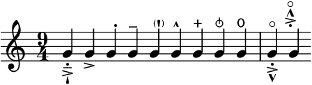
### [tuplet-tremolos.mei](tuplet-tremolos.mei)
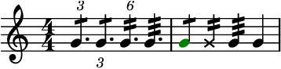
### [ftrem.mei](ftrem.mei)
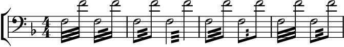
### [harppedal.mei](harppedal.mei)
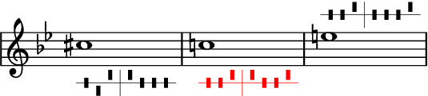
### [bend.mei](bend.mei)
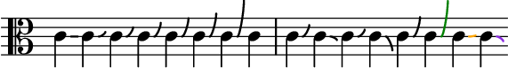
### [tempo-changes.mei](tempo-changes.mei)
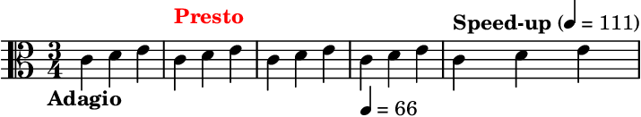
### [unmetered-and-glyphs.mei](unmetered-and-glyphs.mei)
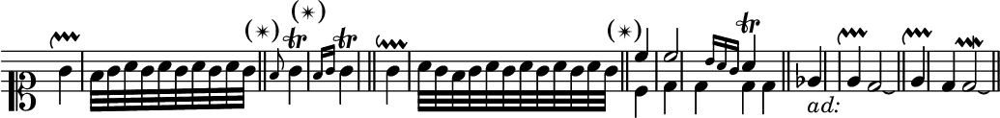
### [clefs.mei](clefs.mei)
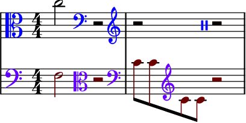
### [namespace-prefixes.mei](namespace-prefixes.mei)
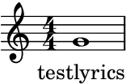
### [beamdirection.mei](beamdirection.mei)
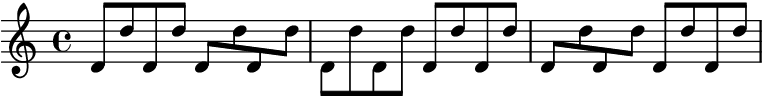
### [brackets.mei](brackets.mei)
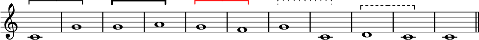
### [trills.mei](trills.mei)
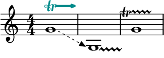
### [tiedchords.mei](tiedchords.mei)
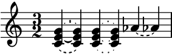
### [tempo-mm-without-mm-unit.mei](tempo-mm-without-mm-unit.mei)
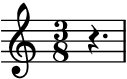
### [slurs.mei](slurs.mei)
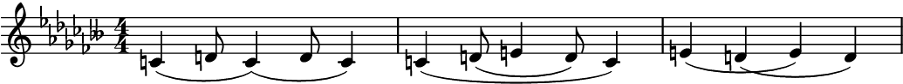
### [easter_egg.mei](easter_egg.mei)
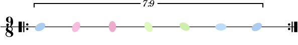
### [noteheads.mei](noteheads.mei)
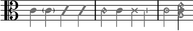
### [dots.mei](dots.mei)

### [dynamics.mei](dynamics.mei)
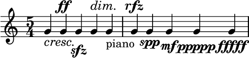
### [ornamentaccid.mei](ornamentaccid.mei)
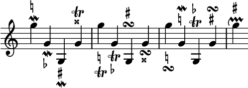
### [mixed-keys.mei](mixed-keys.mei)
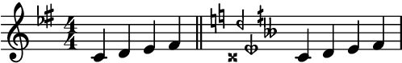
### [gracenotes.mei](gracenotes.mei)
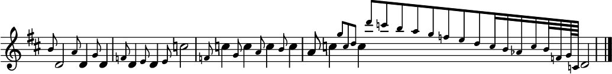
### [multirest-and-reh.mei](multirest-and-reh.mei)
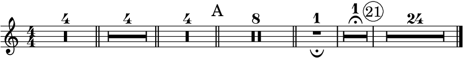
### [enforced-layout.mei](enforced-layout.mei)
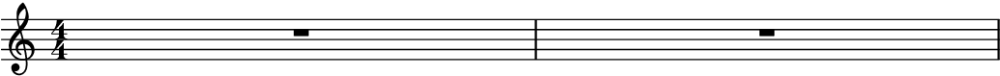
### [stemdir.mei](stemdir.mei)
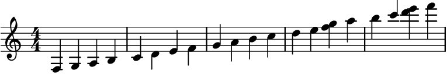
### [dynamic-extender.mei](dynamic-extender.mei)
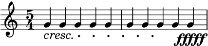
### [stems.mei](stems.mei)
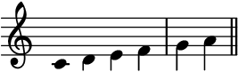
### [color.mei](color.mei)
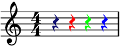
### [annots-and-comments.mei](annots-and-comments.mei)

### [beams.mei](beams.mei)
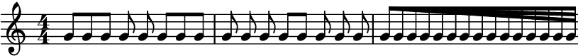
### [fontsize.mei](fontsize.mei)
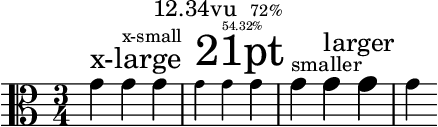
### [tuplets.mei](tuplets.mei)
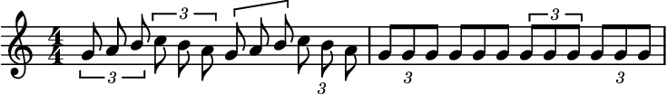
### [general-functions.mei](general-functions.mei)
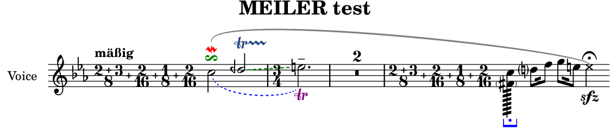
### [cascading-colors.mei](cascading-colors.mei)
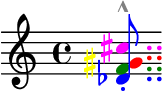
### [labels.mei](labels.mei)
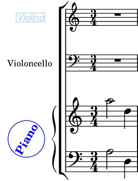
### [hairpins.mei](hairpins.mei)
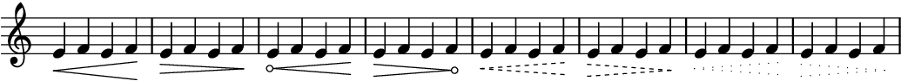
### [spanners-across-measures.mei](spanners-across-measures.mei)
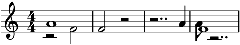
### [cutouts.mei](cutouts.mei)
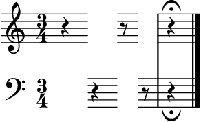
### [partial-measures.mei](partial-measures.mei)
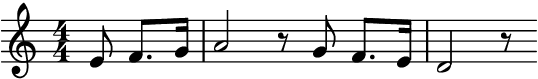
### [voices.mei](voices.mei)
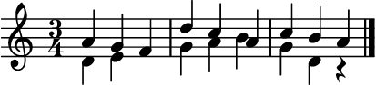
### [pauses.mei](pauses.mei)
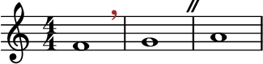
### [breaksec.mei](breaksec.mei)
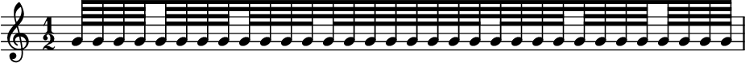
### [merging-rests.mei](merging-rests.mei)
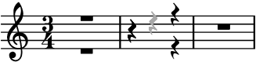
### [ottavas.mei](ottavas.mei)

Rendered with GNU LilyPond 2.24.4 (running Guile 3.0).  
All test files are licensed under a [Creative Commons Attribution 4.0 International License](http://creativecommons.org/licenses/by/4.0/).
