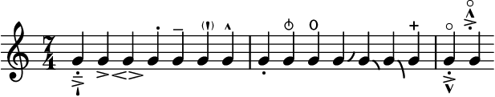
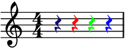

# MEILER TESTS
This is an autogenerated overview of the testfiles.
### [annots-and-comments.mei](annots-and-comments.mei)

### [articulation.mei](articulation.mei)

### [beams.mei](beams.mei)

### [clefs.mei](clefs.mei)

### [color.mei](color.mei)

### [enforced-layout.mei](enforced-layout.mei)

### [fontsize.mei](fontsize.mei)

### [general-functions.mei](general-functions.mei)

### [multirest-and-reh.mei](multirest-and-reh.mei)

### [namespace-prefixes.mei](namespace-prefixes.mei)

### [ornamentaccid.mei](ornamentaccid.mei)

### [partial-measures.mei](partial-measures.mei)

### [spanners-across-measures.mei](spanners-across-measures.mei)

### [stemdir.mei](stemdir.mei)

### [stems.mei](stems.mei)

### [tempo-mm-without-mm-count.mei](tempo-mm-without-mm-count.mei)

### [tuplet-tremolos.mei](tuplet-tremolos.mei)

### [unmetered-and-glyphs.mei](unmetered-and-glyphs.mei)

### [voices.mei](voices.mei)

