# MEILER TESTS
This is an autogenerated overview of the testfiles.
### [endings.mei](endings.mei)
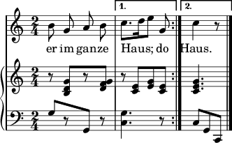
### [dir1.mei](dir1.mei)
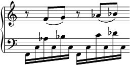
### [beatrpt1.mei](beatrpt1.mei)
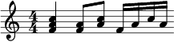
### [lyrics4.mei](lyrics4.mei)
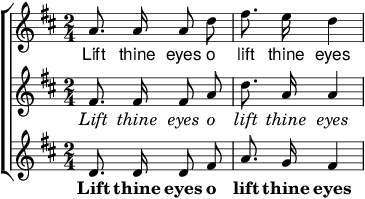
### [scoredef-changes.mei](scoredef-changes.mei)
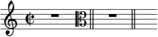
### [trills.mei](trills.mei)
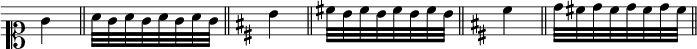
### [cross-staff.mei](cross-staff.mei)
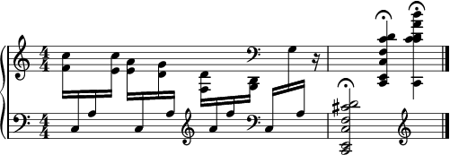
### [artic2.mei](artic2.mei)
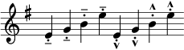
### [tie.mei](tie.mei)
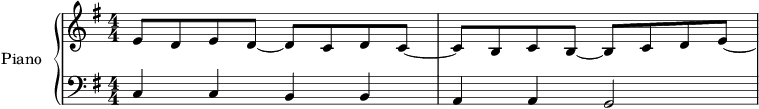
### [chords.mei](chords.mei)
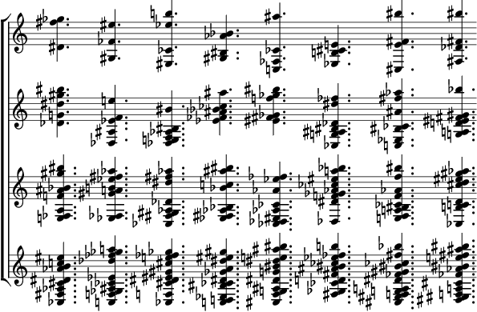
### [mrpt.mei](mrpt.mei)
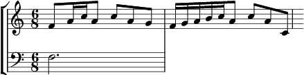
### [fermata1.mei](fermata1.mei)
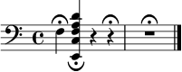
### [color1.mei](color1.mei)
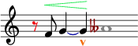
### [tempo1.mei](tempo1.mei)
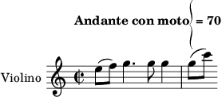
### [verses.mei](verses.mei)
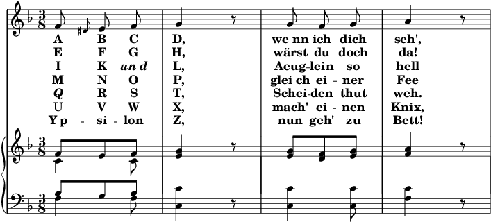
### [lyrics1.mei](lyrics1.mei)
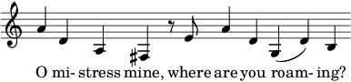
### [lyrics3.mei](lyrics3.mei)
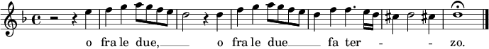
### [clef-changes.mei](clef-changes.mei)
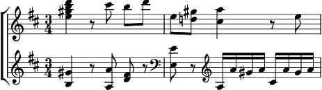
### [beam-breaks.mei](beam-breaks.mei)
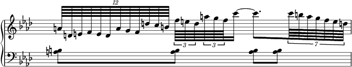
### [lyrics2.mei](lyrics2.mei)
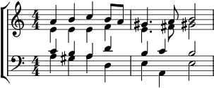
### [gracenotes.mei](gracenotes.mei)
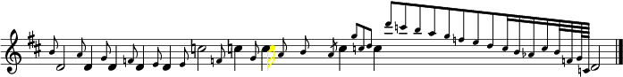
### [app-nested.mei](app-nested.mei)

### [app.mei](app.mei)
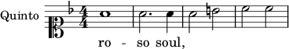
### [hairpin2.mei](hairpin2.mei)
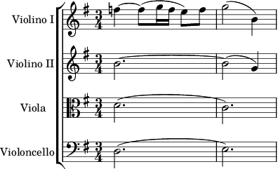
### [space.mei](space.mei)
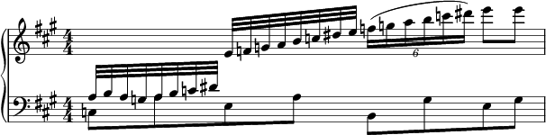
### [tie-chords3.mei](tie-chords3.mei)

### [spacing.mei](spacing.mei)
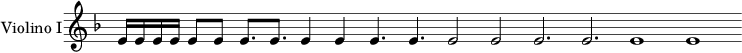
### [piano-pedal.mei](piano-pedal.mei)
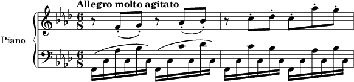
### [choice.mei](choice.mei)
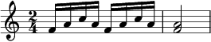
### [btrem.mei](btrem.mei)
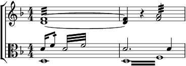
### [barlines.mei](barlines.mei)
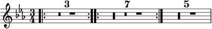
### [score.mei](score.mei)

### [fermata2.mei](fermata2.mei)
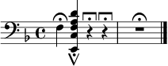
### [hairpin1.mei](hairpin1.mei)
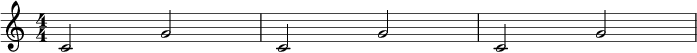
### [mrpt2.mei](mrpt2.mei)
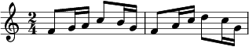
### [beatrpt2.mei](beatrpt2.mei)
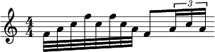
### [dynam1.mei](dynam1.mei)

### [multilingual.mei](multilingual.mei)
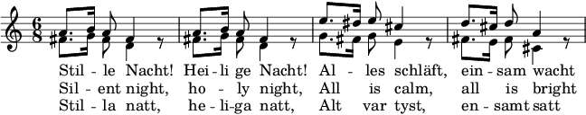
### [multirpt.mei](multirpt.mei)
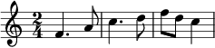
### [harm.mei](harm.mei)

### [tie-chords2.mei](tie-chords2.mei)

### [editorial1.mei](editorial1.mei)
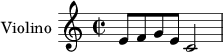
### [tie-chords1.mei](tie-chords1.mei)
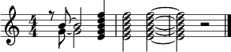
### [turn2.mei](turn2.mei)
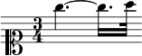
### [artic1.mei](artic1.mei)
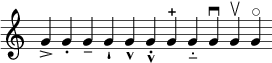
### [mordent.mei](mordent.mei)
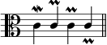
### [tuplet.mei](tuplet.mei)
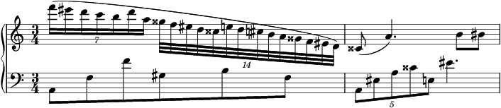
### [dynam2.mei](dynam2.mei)
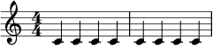
### [ftrem.mei](ftrem.mei)
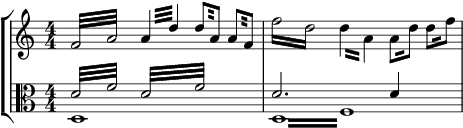
### [octave-shift2.mei](octave-shift2.mei)
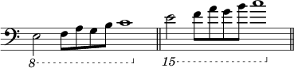
### [octave-shift1.mei](octave-shift1.mei)
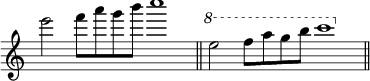
### [turn1.mei](turn1.mei)

### [octave-shift3.mei](octave-shift3.mei)
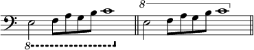
### [tupletspan.mei](tupletspan.mei)
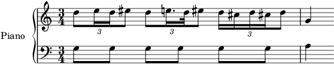
### [dynam3.mei](dynam3.mei)
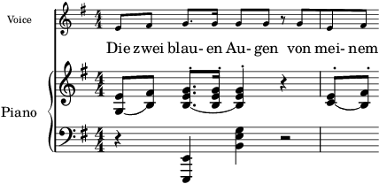
### [editorial2.mei](editorial2.mei)
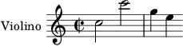
### [key-change.mei](key-change.mei)
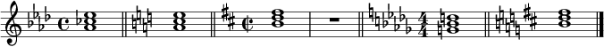
### [mensural.mei](mensural.mei)

### [tempo2.mei](tempo2.mei)

